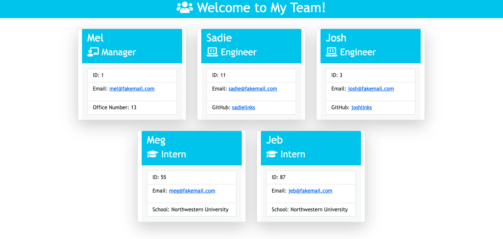
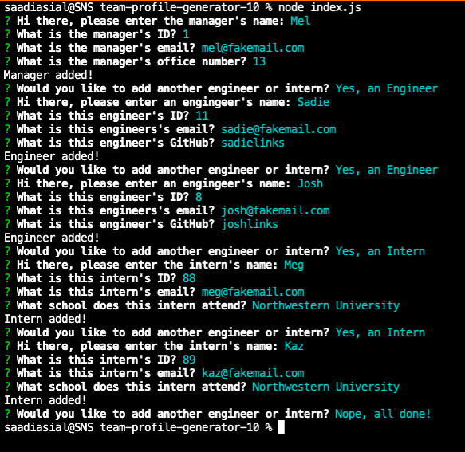
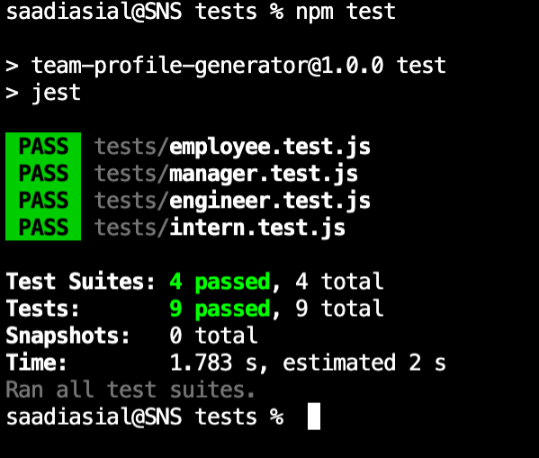

# Team Profile Generator (Bootcamp Assignment 10 - Object-Oriented Programming)

By: Sadie Sial

___


#### Table of Contents

* [Description](#description)
* [Installation](#installation)
* [Usage](#usage)
* [Technologies](#technologies)
* [Screenshots](#screenshots)
* [Links](#links)
* [Contact](#contact)
* [License](#license)
<br><br>

## Description <br>

This command-line application allows for users to install, run, and generate a team profile on an HTML document. Users will specifically be prompted to answer their team manager, engineer(s), and/or intern(s) alongside with corresponding information pertaining to each member's role. Their selected inputs will generate their custom HTML homepage where they can view their team's information conveniently in one place!


### User Story:

```
AS A manager
I WANT to generate a webpage that displays my team's basic info
SO THAT I have quick access to their emails and GitHub profiles
```

```
GIVEN a command-line application that accepts user input
WHEN I am prompted for my team members and their information
THEN an HTML file is generated that displays a nicely formatted team roster based on user input
WHEN I click on an email address in the HTML
THEN my default email program opens and populates the TO field of the email with the address
WHEN I click on the GitHub username
THEN that GitHub profile opens in a new tab
WHEN I start the application
THEN I am prompted to enter the team manager’s name, employee ID, email address, and office number
WHEN I enter the team manager’s name, employee ID, email address, and office number
THEN I am presented with a menu with the option to add an engineer or an intern or to finish building my team
WHEN I select the engineer option
THEN I am prompted to enter the engineer’s name, ID, email, and GitHub username, and I am taken back to the menu
WHEN I select the intern option
THEN I am prompted to enter the intern’s name, ID, email, and school, and I am taken back to the menu
WHEN I decide to finish building my team
THEN I exit the application, and the HTML is generated
```

## Installation

1. Users will need to use `git clone` to clone this repo into their repository. 

- HTTPS
```
https://github.com/sadielinks/team-profile-gen.git
```

- SSH
```
git@github.com:sadielinks/team-profile-gen.git
```

2. They will then need to install the following in their command line:
```
npm i
```

## Usage
1. After the installation process, users will then need to run the following in their command line:
```
node index.js
```
Once they have answered the prompts to the best of their ability, a new file called, `generateTeamHTML.js` will be created in the `dist` folder.


2. In order to run the Jest Testing, users will need to use the following in their command line:
```
npm test
```


## Technologies

The technologies used to create this program were: 
- Javascript
- Dynamic HTML
- Node.JS
- Jest Testing Framework
<br><br>

## Screenshots
```
Generated Team HTML:
```


```
Command Line question/answer:
```


```
Walkthrough Video:
```
https://user-images.githubusercontent.com/87392794/136686100-9a05924c-7465-4cdc-8ef5-5e01d8123fe1.mov


```
Jest Testing:
```


```
Jest Testing Video:
```
https://user-images.githubusercontent.com/87392794/136686106-71cf9421-60b2-444b-8ea1-505f2198c92c.mov


<br>

## Links

- [Walkthrough Video](https://watch.screencastify.com/v/dllRiyzuDIId6wjwH3hR)

- [Testing Video](https://watch.screencastify.com/v/jKS4WXLY4oCkT1KZdAOS)

- [GitHub Repository](https://github.com/sadielinks/team-profile-gen)

<br>

## Contact

- [GitHub Profile](https://github.com/sadielinks)
- [Portfolio](https://sadielinks.github.io/professional-portfolio/)
- [Email](mailto:sadiecodes@gmail.com)

<br>

## License

This source code is available to everyone under the standard [MIT license ©](https://choosealicense.com/licenses/mit/) <br><br>
© 2021 Trilogy Education Services, LLC, a 2U, Inc. brand. Confidential and Proprietary. All Rights Reserved.
